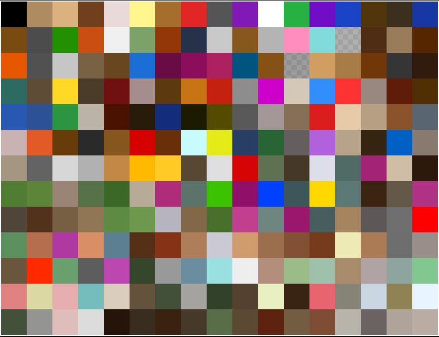

# Cryptopunk-Colors
For a project I'm doing, I wanted to know the exact hexadecimal values of all the colors used in the Cryptopunks. 

## How I did it

Thanks to [@ddaavvee1234's suggestion](https://twitter.com/ddaavvee1234/status/1426545089489350658), I used [Imagemagick](https://imagemagick.org) and could improve the performance tremendously. Plus, we get the occurences. 

```
identify -verbose punks.png
```

More info : https://legacy.imagemagick.org/Usage/quantize/#extract

For previous versions, see commit history. 
I exported the output into a csv that can be easily read. We obtain 222 colors instead of the 228 found with R. That is because we used the large image which does not contain any background.

We can query the csv file to see which colors appear only once :

```R
df[df$OCCURENCE == 1,]
```

returns 

```
    OCCURENCE              RGBA        HEX                  NAME
90          1   (107,99,97,255)  #6B6361FF    srgba(107,99,97,1)
155         1 (176,163,155,255)  #B0A39BFF  srgba(176,163,155,1)
167         1 (186,172,162,255)  #BAACA2FF  srgba(186,172,162,1)
```

Plotting can be done automatically. I installed [`csvkit`](https://csvkit.readthedocs.io/) by doing `pip install csvkit`, then we can load the csv using shell. This is useful because we'll make the canvas ourselves.

To make the canvas, run `sh ./createCanvas.sh`. Read the comments in that file if you want more details on how it works but in short, there are x steps : 

1. Create an empty (transpareng BG) canvas
2. Create a temporary file that contains only the hex values, from most common to least common
3. Read each line of that file and color the pixels of the canvas accordingly (from left to right and top to bottom)


Here is the result (HR added manually)

